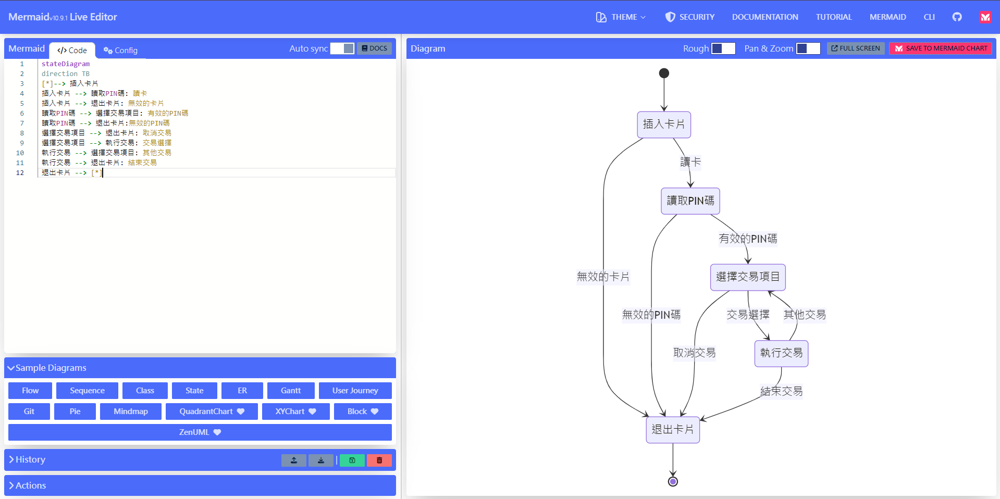
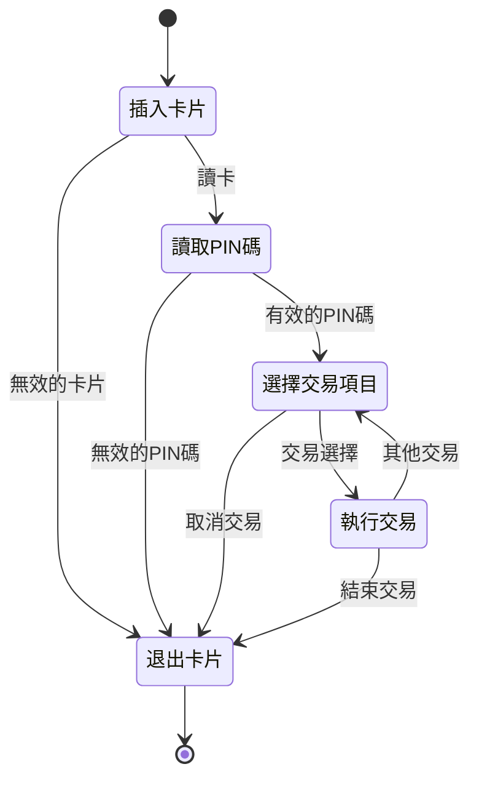
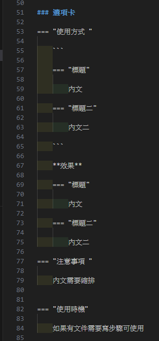

# 其他常用

### Mermaid使用方式

使用[Mermaid Live Edit](https://mermaid.live/edit)編輯mermaid  



- **status mermaid**  


```
 
 ```mermaid
 
 stateDiagram
 direction TB
 [*]--> 插入卡片
 插入卡片 --> 讀取PIN碼: 讀卡
 插入卡片 --> 退出卡片: 無效的卡片
 讀取PIN碼 --> 選擇交易項目: 有效的PIN碼
 讀取PIN碼 --> 退出卡片:無效的PIN碼
 選擇交易項目 --> 退出卡片: 取消交易
 選擇交易項目 --> 執行交易: 交易選擇
 執行交易 --> 選擇交易項目: 其他交易
 執行交易 --> 退出卡片: 結束交易
 退出卡片 --> [*]
 
 ```

```



### 選項卡

=== "使用方式 "

    ```
    
    === "標題"
    
        內文

    === "標題二"

        內文二

    ```

    **效果**

    === "標題"

        內文

    === "標題二"

        內文二

=== "注意事項 "

    內文需要縮排


=== "使用時機"

    如果有文件需要寫步驟可使用    


  


### checkbox

    ```ts
    - [ ] 集保admin
    - [x] 集保主管
    - [x] 集保經辦
    - [ ] 集保理級
    - [ ] 申請單位代號 admin 
    - [ ] 申請單位代號主管
    - [ ] 申請單位代號經辦

    ```    

- [ ] 集保admin
- [x] 集保主管
- [x] 集保經辦
- [ ] 集保理級
- [ ] 申請單位代號 admin 
- [ ] 申請單位代號主管
- [ ] 申請單位代號經辦


### 文字上色方式


{{ read_csv(('table/extra.csv' ) ) }}

!!! warning
    為使用雙框，此文檔不能使用斜體


### 表格使用方式  

[表格使用方式參考](https://squidfunk.github.io/mkdocs-material/reference/data-tables/)

```md
| 姓名   | 年齡   | 職業  |
| :---- | :----: | ----: |
| 置左   | 置中   | 置右  |
| 張三   | 30    | 工程師 |
| 李四   | 25    | 設計師 |
| 王五   | 35    | 醫生   |

```

-   讀取excel表格

:   [excel表格參考](https://timvink.github.io/mkdocs-table-reader-plugin/)

**語法**:

`{{` read_csv('table/test.csv') `}}`  

{{ read_csv('table/test.csv') }}

!!! info "對齊方式" 
    使用colalign=("center","center","center")，{==有多個欄位想設定就填幾個==}<br>
    **不填寫預設文字靠左數字靠右**

`{{` read_csv(('table/test.csv' ) , colalign=("left","center","right")) `}}`

{{ read_csv(('table/test.csv' ) , colalign=("left","center","right")) }}


<div class="inline-end-wrapper">
       
    
    <div class="inline-end-left  admonition note">
        <p class="admonition-title">!!! note 
            使用這款插件是為了更方便製作表格，建議使用CSV格式。<br>

            存檔時選擇"CSV UTF-8(逗號分隔)" 若不選擇此格式會亂碼<br>

            若亂碼可使用記事本打開後轉存，轉存時選擇編碼方式為{==使用BOM的UTF-8==}    
        </p>
    </div>
    <div class="inline-end-left">
    
    </div>
</div>

-   **在表格內要換行有兩種方式**

=== "使用 `<br>` "

    -   使用br  

    {{ read_csv('table/6-1-1查詢區之條件說明.csv') }}  

=== "在excel格子內換行"

    -   使用alt+enter(在excel格子內換行)

    {{ read_csv('table/6-1-1-2查詢區之條件說明.csv') }}  


---


!!! info "使用與不使用差別"
    **使用< br>標籤時在MD顯示會較為清楚，但在excel撰寫時可能會導致易讀性較差<br>
    在excel格子內換行的話撰寫易讀性較高，但在MD顯示會較不清楚。**


### 待討論議題Icon:material-chat-question:{ .question}

在想要放置icon的地方使用`:material-chat-question:{ .question}`
```
:material-chat-question:{ .question}
```
像這樣:material-chat-question:{ .question}


